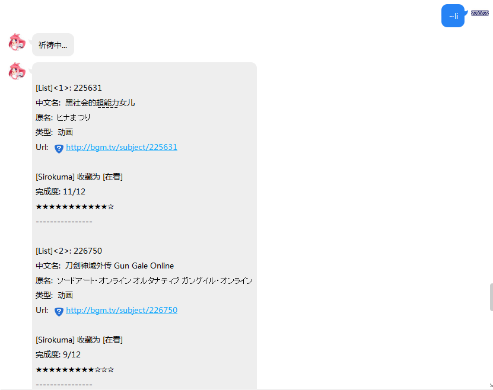
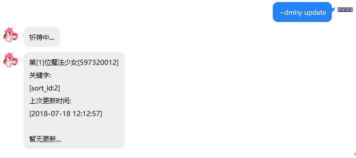
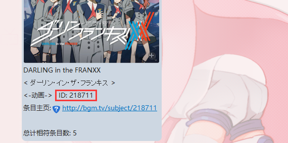
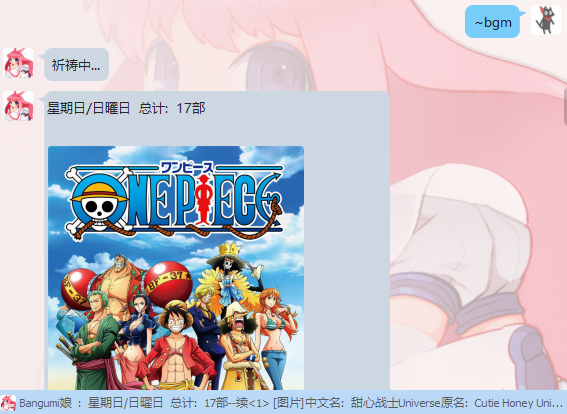

Bangumi娘的食用指南
===================

序章
----

### 简介及用途

#### 简介

Bangumi娘是基于 [CoolQ HTTP API](https://github.com/richardchien/coolq-http-api)
以及 [Bangumi API](https://github.com/bangumi/api) 通过PHP及SQL实现的

网页说明文档: [Bangumi娘的食用指南](http://www.irisu.cc/bangumi/)

#### 用途

用于在QQ平台便捷地查寻条目，更新条目进度

### 基础指南

1.一切想要被回应命令的必须以英文输入下的做「\~」或者「!」，诸如「～」「！」大概不会被受理……

2.请注意参数之间以**一个空格**隔开

3.当你忘记了某些指令的全称，你可以通过使用\~/!+首字母，Bangumi娘回复相关提示

示例：

4.指令是不区分大小写的，但是参数就不一定了，通过\~user和\~USER甚至更糟的\~UseR都能实现同一个功能

示例：

5.指令的识别是逐字匹配，也就是说\~user与\~userxxxx效果等同，但空格就另当别论了，空格是分隔参数的唯一字符

6.请注意，Bangumi娘的祈祷可能会真正成为祈祷……可能的原因有：

\<1\>不可抗力

\<2\>参数超出了预想

\<3\>维护

7.暂时不支持自动加群，因为种种原因…

Bangumi娘QQ号：1243000303

讨论群：477741212

指令手册
--------

### 指令表示规则及术语

#### 指令表示规则

\<空\> 代表没有参数

\<参数X \*\> 代表第X个必填参数，\<\>内的\*表示是必须参数

\<参数X \~\> 代表第X个可选参数

\<参数X !\> 代表第X个可以省略的参数

\<参数X \^\> 代表第X个可向上顺延一位的参数，这种情况只出现在\~subject,
\~up,\~co,\~save指令，为了便捷使用同一个条目ID，每当用户\~subject
[条目ID]一个条目就会自动保存当前条目ID，这样用户可以下次只需输入\~subject而不需要参数就可以得到上一次\~subject
[条目ID]的结果，这样的话之后原本的参数可以向前顺延取代上一个参数的位置，这里的[条目ID]参数既是\<参数X
!\>

注意，以上标记可以相互叠加

\#0\~25 是魔法少女专用的“背包位”

\#1 代表吉祥物的一号魔力 (条目ID)

\#0 特指上一次搜索的ID，只有某些情况可用，因此最好不要使用

#### 术语

魔法少女：即为绑定了Bangumi的QQ用户

魔杖：从Bangumi获得的access token (哼哼,可要想好咯,一旦交给我…)

吉祥物：用于存放用户”魔力”的容器，当前设置大小为25个，也就是说最多存储25个条目

魔力：条目ID

### U系列指令

#### user指令:

\~user \<参数1 \*\>[必填:Bangumi UID或用户名]

**用途**: 回复指定用户的UID,头像,昵称和URL

**示例**:

#### unreg指令

\~unreg \<空\>

**说明**: 无参数

**用途**:

1.解除Bangumi与当前QQ绑定的授权，

2.由于不可抗力因素存在而导致的绑定信息有不可恢复的问题可以使用该命令解除绑定再通过\~reg重新绑定，不过一般情况下使用\~reg重新注册以刷新数据可以得到解决

**示例**：

**注意**: 使用\~unreg将删除数据库中所有相关存储，编号也会丢失，请慎用

#### up指令\<仅限魔法少女使用\>

\~up \<参数 1 !\>[可省略:所要更新的条目ID(三种方式，例如:222001,\#2,“空”)]

\<参数 2 \^\*\>[必填:所需更新的章节数，例如:12 表示将12话及其之前的全部标记完成]

\<参数 3
\^\~\>[可选:是否列出条目详细的标志参数，只识别“\*”，若是“\*”则会自动请求一次\~subject，如果不是也不会有什么影响]

**说明**:

1.例如\#10，如果这个位置没有存过ID是不会给出条目信息的

2.如果没有首先收藏条目也会失败

**用途**: 用于批量更新指定条目进度

**示例**:

用户没有注册

正常使用

这里之前我特意使用了\~su
202880，这时会记录上一次的条目ID为202880，从而可以免重复输入，省略了\<参数1\>

**注意**:

1.更新时请确保已经收藏了该条目，否则会失败

2.如果想要更新的章节数与已经标记的一样则会失败

### S系列指令

#### search/se指令

\~search \<参数 1 \*\>[必填: 想要搜索条目的关键字]

\<参数 2 \~\>[可选: 想要搜索条目的类型，具体请参考后续说明，默认所有类型]

\<参数 3 \~\>[可选: 搜索结果的开始标号，默认从0开始]

\<参数 4 \~\>[可选: 搜索结果的最大显示数(上限25个)，默认5个]

**说明**:

1.\~search 可用 \~se 代替

1.  条目的类型的对应编号: 输入1即代表只搜索书籍

array(

1 =\> "书籍",

2 =\> "动画",

3 =\> "音乐",

4 =\> "游戏",

6 =\> "三次元"

);

**用途**: 用于搜索指定关键字相关的条目简短信息以及条目ID，从而进行\~subject
等操作

**示例**:

只搜索类型为动画的条目:

**注意**: \<参数1\>如有空格,请使用+代替

#### subject/su指令

\~subject \<参数 1 !\>[可省略: 想要搜索的条目ID(三种方式，例如:222001,
\#2,“空”)]

\<参数 2 \~\^\>[可选:
条目信息的详细度参数，具体请参考后续说明，默认只有条目信息]

**说明**:

1.\~ subject 可用 \~su 代替

1.  条目信息的详细度参数: 输入\* 即代表额外回复条目角色

array(

=\> "只有条目信息",

\* =\> "增加收录的角色",

\*\* =\> "增加收录的角色以及cv"

);

1.  例如\#10，如果这个位置没有存过ID是不会给出条目信息的

**用途**:
用于搜索指定条目详细信息，此外如果用户已经注册(\~reg)，则会返回用户对此条目的收藏情况

**示例**:

注意: 正篇只13话，SP不会算入，因此可能出现完成度溢出

使用可选参数 \*

更详细的信息 \*\*

未注册用户（不能直接使用 \#或者省略）

但能够使用条目ID，但不会显示个人信息，查询功能没有缩减

#### save/sa指令\<仅限魔法少女使用\>

\~save \<参数 1 !\>[可省略: 想要保存的条目ID(三种方式，例如:222001, \#2,“空”)]

\<参数 2 \*\^\>[必填:
想要放入吉祥物的位置编号，1\~25选一个吧，然而经常会不自觉地加一个\#变成
\#1-25，所以这样也没问题]

**说明**:

1.\~save 可用 \~sa 代替

1.  请确保\<参数2\>是1-25内的一个数字，当然凡是使用\#都要确保的，否则

**用途**:
用于用户自定义保存条目ID以方便之后命令快速使用条目ID，当前条目的集合请使用list/li指令查看

**示例**:

**注意**:

请注意，如果既想省略\<参数 1 \>又想使用\<参数 2 \>的\#形式，很遗憾，这是不可的

### C系列指令

#### collect/co指令\<仅限魔法少女使用\>

\~collect \<参数 1 !\>[可省略: 想要收藏的条目ID(三种方式，例如:222001,
\#2,“空”)]

\<参数 2 \^\*\>[必填:
想要收藏的状态，具体请参考后续说明，输入有误或为空则为wish]

\<参数 3 \^\~\>[可选:
是否列出条目详细的标志参数，只识别“\*”，若是“\*”则会自动请求一次\~subject]

\<参数 4 \^\^\~\>[可选: 想要给此条目的评分，1-10，否则没有打分]

\<参数 5 \^\^\~\>[可选: 想要对此条目的吐槽，请注意空格问题]

**说明**:

1.\~collect 可用 \~co 代替

2.条目的收藏的状态: 输入do即代表在看/玩/听/读

**array(**

**'wish' =\> "想看/玩/听/读",**

**'collect' =\> "看/玩/听/读过",**

**'do' =\> "在看/玩/听/读",**

**'on_hold' =\> "搁置",**

**'dropped' =\> "抛弃"**

**);**

**用途**: 用于将指定条目收藏，从而进行\~up 操作

**示例**:

我的18号位正好存着ID的18条目，请别被迷惑了

### B系列指令

#### bangumi/bgm指令

\~bangumi \<参数 1 \~\>[可选: 想要查询放送表的日期，1-7代表 星期一 到
星期天，默认给予当天的放送表]

**说明**: \~bangumi 可用 \~bgm 代替

**用途**: 用于查询指定星期数的动画放送表条目

**示例**:

参数有误仍默认当天放送表

### L系列指令

#### list/li指令\<仅限魔法少女使用\>

\~list \<参数 1 \~\>[可选:
想要搜索的背包位，范围是1-25，如果不填或有误默认全部，如果输入”\*”则为有封面图版，否则只有文字]

**说明**: \~list 可用 \~li 代替

**用途**: 用于列出背包存储的指定或者全部条目ID

**示例**:

默认的list指令

加了参数”\*”的list，速度稍微较慢

使用参数 1-25

### H系列指令

#### h指令

\~h \<空\>

**说明**: 伪help指令

**示例**:

### R系列指令

#### reg指令

\~reg \<无\>

**说明**:

1.  无参数

2.  这条指令仅限私聊，涉及到保密，请不要将链接随便外放

**用途**:

1.用于签订契约成为魔法少女(将Bangumi授权与当前QQ号绑定)

2.也能用于刷新授权，当前还有一些问题未解决可以通过\~reg手动刷新权限，或者\~unreg之后重新\~reg

**示例**:

**注意**:

打开网站授权后如果没有看到很多bangumi娘并且Bangumi娘也没有回复你的话证明此次行为失败，原因是如果Bangumi授权页面打开时还未处于登陆状态，请保存登陆信息再次打开链接授权

### F系列指令

#### fm/radio指令

\~fm \<空\>

\~radio \<空\>

**说明**: 无参数，两者作用相同

**用途**: 返回一些日本ACG音乐电台，打开链接下载后使用音乐播放器打开即可

**示例**:

### DMHY系列指令 – New

#### 简介

这是一个用于订阅资源的功能，dmhy就是动漫花园的意思，动漫花园是一个BT资源站，通过dmhy系列指令你能够实现所需资源的推送功能，现在的设定是每小时会更新一次资源列表，如果有更新，Bangumi娘便会给你推送资源，当然你也能手动更新，请注意推送的必要条件是你最近更新资源的发布时间为起点，以前的资源会被无视，而且一次推送资源的上限是20条。

#### 使用

这一系列的指令开头都是\~dmhy，大致有五个功能，分别是：推送的开启和关闭，推送的关键字设定，推送的资源来源（有動漫花園和萌番組），手动更新推送，推送的设定查询。

#### 功能-推送的开启

\~dmhy open \<参数1 \*\>[必填:”true”或者”false”]

**说明**: true是开启，false是关闭

**用途**: 开启或关闭自动推送功能（每小时），但能手动更新

**示例:**.

#### 功能-推送的关键字

\~dmhy keyword \<参数1
\*\>[必填:你想要的搜索的关键字，**注意：空格用+代替，其他具体的关键字请根据资源网相应制定**]

**说明**:
通过关键字你能够获得你想要的资源，就像百度搜索那样，最好还是上资源网手动搜索看看到底是不是自己想要的或者能不能搜到相应资源再来设置到Bangumi娘上，否则可能一直得不到推送或者其他问题

**用途**: 确定想要获得推送的资源

**示例:**.

#### 功能-推送的资源来源

\~dmhy select \<参数1 \*\>[必填:”dmhy”或者”moe”]

**说明**: dmhy是
动漫花园的资源站(share.dmhy.org)，moe是萌番组的资源站(bangumi.moe)

**用途**: 确定想要得到推送的资源的来源站：两个稍有不同：

动漫花园: 推送的资源下载链接是I型的磁力链接

萌番组: 推送的资源下载链接是种子下载链接

请根据个人需要选择

**示例:**.

#### 功能-推送的手动更新

\~dmhy update \<空\>

**说明**: 无参数

**用途**:
手动刷新推送一次，但此次推送会影响到每小时推送，推送过的就不会再推送了噢

**示例:**.

#### 功能-推送的设定查询

\~dmhy get \<参数1 \~\>[可选:”open”，”date”，”keyword”或者”select”]

**说明**: 可选参数，如果没有参数或者参数有误会将所有信息都列出来

Open =\> 开启状态

Date =\> 最新的资源推送时间

Keyword =\> 搜索关键字

Select =\> 选择的资源站

**用途**: 查询自己设定的推送设置

**示例:**.

使用流程示例
------------

### 注册

发送\~reg进行注册

点击链接跳转授权页面（确保Bangumi已经处于登陆状态）

点击授权（页面会跳转），成功的话会看到下面这种情况

同时Bangumi娘也会进行回复

到此便已经完成了注册，当您再次\~reg打开链接或者打开之前的链接即重新reg则会刷新权限信息

成功刷新授权信息则会看到

至此完成注册

### 搜索

找到想要看的番组可以使用\~se搜索关键字或者\~bgm查看每天放松表从而进行收藏操作或者save

使用\~search搜索

可以找到条目的ID，比如上面的218711即为DARLING in the FRANXX的条目ID

使用\~bgm搜索

可以得知海贼王的ID为975

### 查询

当有了条目ID以后，也许你想查看更加详细的条目资料

请使用\~subject

例如刚才搜索的DARLING in the FRANXX（ID: 218711）

当然你也可以使用额外的参数从而查看角色信息等，具体查看之前的\~subject指令说明

由于您已经注册了(reg)，那么你可以使用省略条目ID参数的魔法，就在刚才我们搜索了

DARLING in the FRANXX（ID:
218711）那么在您下次使用\~subject之前，条目ID就默认是218711了

**注意**：当使用某些指令(up,co)的\*参数时会自动请求一次\~subject也就是说会更改默认ID为当前subject
的ID

例如

### 收藏

我们已经可以使用省略条目ID了，那么接下来我们操作更加轻松

就在刚才我们使用\~subject查看DARLING in the
FRANXX的资料时，我们看到最后一行显示了

\<未收藏\>
这是因为我这个Bangumi账号还未标记过这部番，如果您之前已经收藏过则可以免去这个步骤

使用\~co指令将其标记为在看

嗯，接下来就能更新了

除此之外，您也可以标记为看完等等其他状态，也能附加评分和吐槽，具体请查看指令说明

比如我看完了条目175603

则可以这样

### 保存和取出

当您可以同时观看多部番，\~save是一个不错的选择，最多25个位置您可以放常用的条目ID以便使用

就比如我将DARLING in the FRANXX放到吉祥物1号位

将七大罪 圣战的预兆放到吉祥物2号位

能省略ID是因为就在上一个步骤最后我搜索了七大罪 圣战的预兆

那么使用吉祥物吧

通过\~list能查看当前存储的所有ID，也能单独获取，详情请看指令说明

然后我发现七大罪这个收藏错状态了，我就能使用\~co直接使用\#操作

同样的，凡是相关条目ID的指令都能使用\#直接使用吉祥物中存储的ID

### 更新

当您已经收藏了某部番，需要更新其进度，则需要使用\~up指令

还拿之前的DARLING in the FRANXX例子做示范，比如我看完了21集

就可以像下面这样（上次搜索为DARLING in the FRANXX）

嗯，的确起到作用了

### 注销

也许你遇到了不可解决的账号问题，又或者你真的不想再利用Bangumi娘了，请使用\~unreg解除契约

嗯，不会提示什么，只要你说了\~unreg，Bangumi娘总是这么说，实际上也的确是这样…
