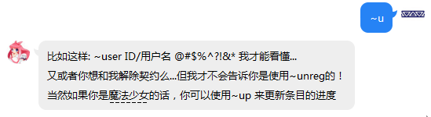
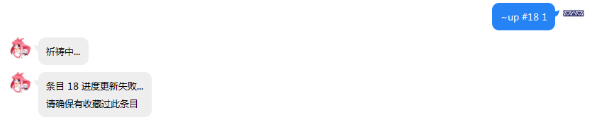
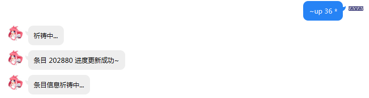
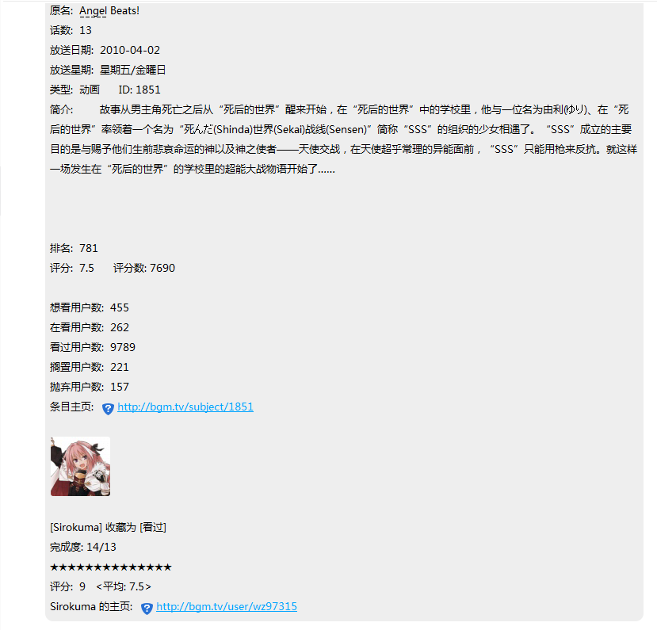
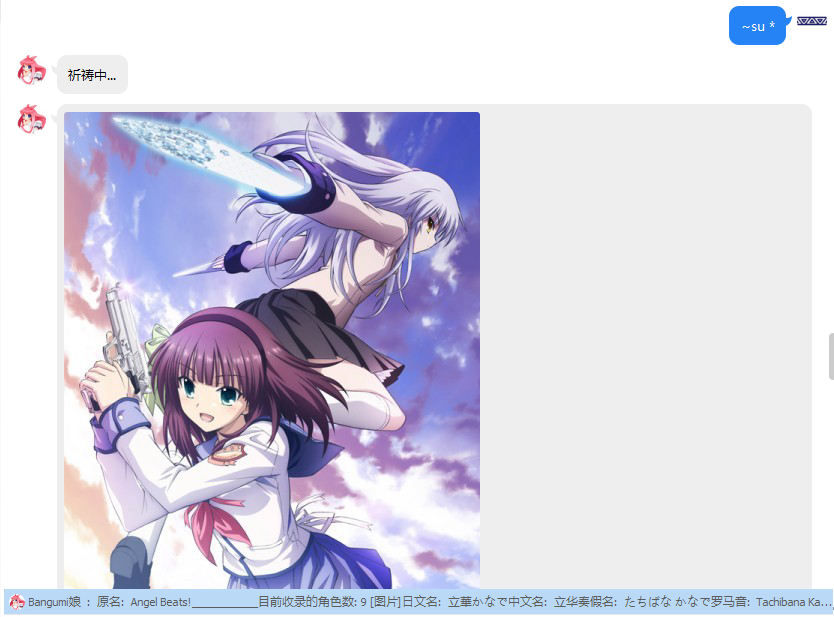
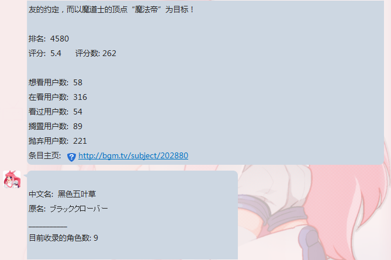
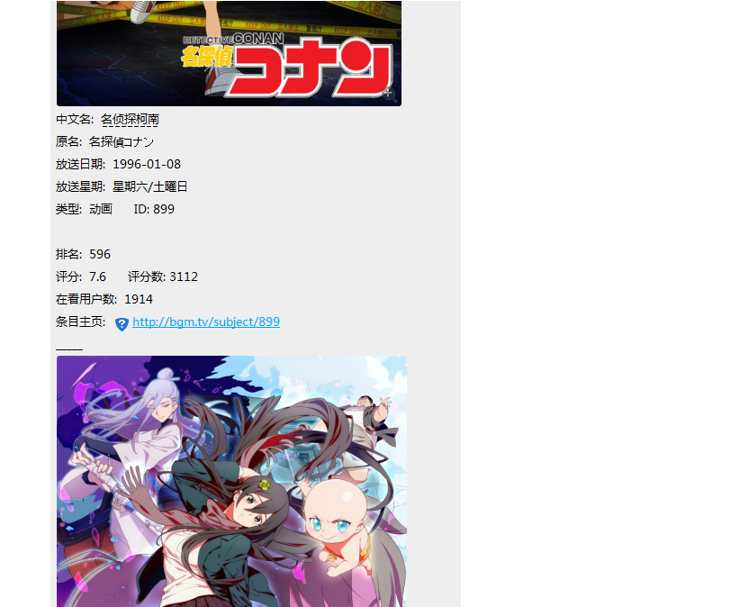
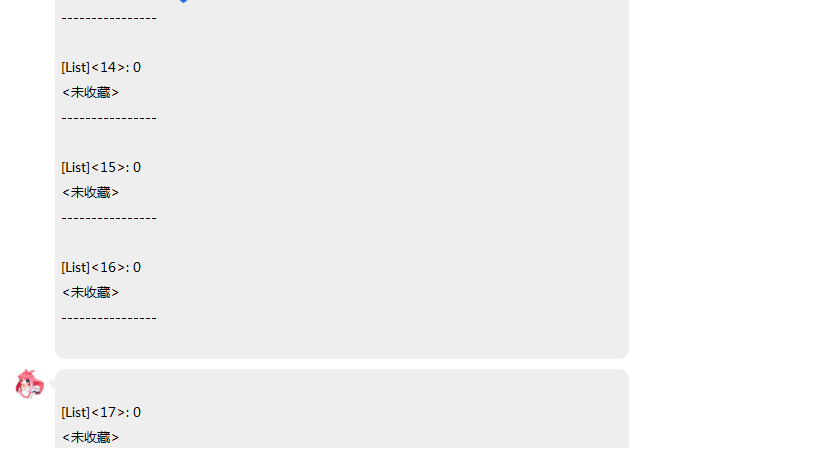


Bangumi娘的食用指南
===================

序章
----

### 简介及用途

#### 简介

Bangumi娘是基于 <a href="https://github.com/richardchien/coolq-http-api" target="_blank">CoolQ HTTP API</a> 以及 <a href="https://github.com/bangumi/api" target="_blank">Bangumi API</a> 通过PHP及SQL实现的

#### 用途

用于在QQ平台便捷地查寻条目，更新条目进度

### 基础指南

1.一切想要被回应命令的必须以英文输入下的做「\~」或者「!」，诸如「～」「！」大概不会被受理……

2.请注意参数之间以**一个空格**隔开

3.当你忘记了某些指令的全称，你可以通过使用\~/!+首字母，Bangumi娘回复相关提示

示例：

4.指令是不区分大小写的，但是参数就不一定了，通过\~user和\~USER甚至更糟的\~UseR都能实现同一个功能

示例：

5.指令的识别是逐字匹配，也就是说\~user与\~userxxxx效果等同，但空格就另当别论了，空格是分隔参数的唯一字符

6.请注意，Bangumi娘的祈祷可能会真正成为祈祷……可能的原因有：

\<1\>不可抗力

\<2\>参数超出了预想

\<3\>维护

7.暂时不支持自动加群，因为种种原因…

Bangumi娘QQ号：1243000303

讨论群：477741212

指令手册
--------

### 指令表示规则及术语

#### 指令表示规则

\<空\> 代表没有参数

\<参数X \*\> 代表第X个必填参数，\<\>内的\*表示是必须参数

\<参数X \~\> 代表第X个可选参数

\<参数X !\> 代表第X个可以省略的参数

\<参数X \^\> 代表第X个可向上顺延一位的参数，这种情况只出现在\~subject,
\~up,\~co,\~save指令，为了便捷使用同一个条目ID，每当用户\~subject
[条目ID]一个条目就会自动保存当前条目ID，这样用户可以下次只需输入\~subject而不需要参数就可以得到上一次\~subject
[条目ID]的结果，这样的话之后原本的参数可以向前顺延取代上一个参数的位置，这里的[条目ID]参数既是\<参数X
!\>

注意，以上标记可以相互叠加

\#0\~25 是魔法少女专用的“背包位”

\#1 代表吉祥物的一号魔力 (条目ID)

\#0 特指上一次搜索的ID，只有某些情况可用，因此最好不要使用

#### 术语

魔法少女：即为绑定了Bangumi的QQ用户

魔杖：从Bangumi获得的access token (哼哼,可要想好咯,一旦交给我…)

吉祥物：用于存放用户”魔力”的容器，当前设置大小为25个，也就是说最多存储25个条目

魔力：条目ID

### U系列指令

#### user指令:

\~user \<参数1 \*\>[必填:Bangumi UID或用户名]

**用途**: 回复指定用户的UID,头像,昵称和URL

**示例**:

#### unreg指令

\~unreg \<空\>

**说明**: 无参数

**用途**:

1.解除Bangumi与当前QQ绑定的授权，

2.由于不可抗力因素存在而导致的绑定信息有不可恢复的问题可以使用该命令解除绑定再通过\~reg重新绑定，不过一般情况下使用\~reg重新注册以刷新数据可以得到解决

**示例**：

**注意**: 使用\~unreg将删除数据库中所有相关存储，编号也会丢失，请慎用

#### up指令\<仅限魔法少女使用\>

\~up \<参数 1 !\>[可省略:所要更新的条目ID(三种方式，例如:222001,\#2,“空”)]

>   \<参数 2 \^\*\>[必填:所需更新的章节数，例如:12
>   表示将12话及其之前的全部标记完成]

>   \<参数 3
>   \^\~\>[可选:是否列出条目详细的标志参数，只识别“\*”，若是“\*”则会自动请求一次\~subject，如果不是也不会有什么影响]

**说明**:

1.例如\#10，如果这个位置没有存过ID是不会给出条目信息的

2.如果没有首先收藏条目也会失败

**用途**: 用于批量更新指定条目进度

**示例**:

用户没有注册

正常使用

这里之前我特意使用了\~su
202880，这时会记录上一次的条目ID为202880，从而可以免重复输入，省略了\<参数1\>

**注意**:

1.更新时请确保已经收藏了该条目，否则会失败

2.如果想要更新的章节数与已经标记的一样则会失败

### S系列指令

#### search/se指令

\~search \<参数 1 \*\>[必填: 想要搜索条目的关键字]

\<参数 2 \~\>[可选: 想要搜索条目的类型，具体请参考后续说明，默认所有类型]

>   \<参数 3 \~\>[可选: 搜索结果的开始标号，默认从0开始]

>   \<参数 4 \~\>[可选: 搜索结果的最大显示数(上限25个)，默认5个]

**说明**:

1.\~search 可用 \~se 代替

2. 条目的类型的对应编号: 输入1即代表只搜索书籍

array(

1 =\> "书籍",

2 =\> "动画",

3 =\> "音乐",

4 =\> "游戏",

5 =\> "三次元"

);

**用途**: 用于搜索指定关键字相关的条目简短信息以及条目ID，从而进行\~subject
等操作

**示例**:

只搜索类型为动画的条目:

**注意**: \<参数1\>如有空格,请使用+代替

#### subject/su指令

\~subject \<参数 1 !\>[可省略: 想要搜索的条目ID(三种方式，例如:222001,
\#2,“空”)]

>   \<参数 2 \~\^\>[可选:
>   条目信息的详细度参数，具体请参考后续说明，默认只有条目信息]

**说明**:

1.\~ subject 可用 \~su 代替

2. 条目信息的详细度参数: 输入\* 即代表额外回复条目角色

array(

=\> "只有条目信息",

\* =\> "增加收录的角色",

\*\* =\> "增加收录的角色以及cv"

);

3. 例如\#10，如果这个位置没有存过ID是不会给出条目信息的

**用途**:
用于搜索指定条目详细信息，此外如果用户已经注册(\~reg)，则会返回用户对此条目的收藏情况

**示例**:

注意: 正篇只13话，SP不会算入，因此可能出现完成度溢出

使用可选参数

第二条信息

更详细的信息

未注册用户

#### save/sa指令\<仅限魔法少女使用\>

\~save \<参数 1 !\>[可省略: 想要保存的条目ID(三种方式，例如:222001, \#2,“空”)]

>   \<参数 2 \*\^\>[必填:
>   想要放入吉祥物的位置编号，1\~25选一个吧，然而经常会不自觉地加一个\#变成
>   \#1-25，所以这样也没问题]

**说明**:

1.\~save 可用 \~sa 代替

2. 请确保\<参数2\>是1-25内的一个数字，当然凡是使用\#都要确保的，否则

**用途**:
用于用户自定义保存条目ID以方便之后命令快速使用条目ID，当前条目的集合请使用list/li指令查看

**示例**:

**注意**:

请注意，如果既想省略\<参数 1 \>又想使用\<参数 2 \>的\#形式，很遗憾，这是不可的

### C系列指令

#### collect/co指令\<仅限魔法少女使用\>

\~collect \<参数 1 !\>[可省略: 想要收藏的条目ID(三种方式，例如:222001,
\#2,“空”)]

>   \<参数 2 \^\*\>[必填:
>   想要收藏的状态，具体请参考后续说明，输入有误或为空则为wish]

>   \<参数 3 \^\~\>[可选:
>   是否列出条目详细的标志参数，只识别“\*”，若是“\*”则会自动请求一次\~subject]

\<参数 4 \^\^\~\>[可选: 想要给此条目的评分，1-10，否则没有打分]

>   \<参数 5 \^\^\~\>[可选: 想要对此条目的吐槽，请注意空格问题]

**说明**:

1.\~collect 可用 \~co 代替

2.条目的收藏的状态: 输入do即代表在看/玩/听/读

array(

'wish' =\> "想看/玩/听/读",

'collect' =\> "看/玩/听/读过",

'do' =\> "在看/玩/听/读",

'on_hold' =\> "搁置",

'dropped' =\> "抛弃"

);

**用途**: 用于将指定条目收藏，从而进行\~up 操作

**示例**:

我的18号位正好存着ID的18条目，请别被迷惑了

### B系列指令

#### bangumi/bgm指令

\~bangumi \<参数 1 \~\>[可选: 想要查询放送表的日期，1-7代表 星期一 到
星期天，默认给予当天的放送表]

**说明**: \~bangumi 可用 \~bgm 代替

**用途**: 用于查询指定星期数的动画放送表条目

**示例**:

参数有误仍默认当天放送表

### L系列指令

#### list/li指令\<仅限魔法少女使用\>

\~list \<参数 1 \~\>[可选: 想要搜索的背包位，范围是1-25，如果不填或有误默认全部]

**说明**: \~list 可用 \~li 代替

**用途**: 用于列出背包存储的指定或者全部条目ID

**示例**:

这是有误的参数，因此默认全部列出

### H系列指令

#### h指令

\~h \<空\>

**说明**: 伪help指令

**示例**:

### R系列指令

#### reg指令

\~reg \<无\>

**说明**:

1. 无参数

2. 这条指令仅限私聊，涉及到保密，请不要将链接随便外放

**用途**:

1.用于签订契约成为魔法少女(将Bangumi授权与当前QQ号绑定)

2.也能用于刷新授权，当前还有一些问题未解决可以通过\~reg手动刷新权限，或者\~unreg之后重新\~reg

**示例**:

**注意**:

打开网站授权后如果没有看到很多bangumi娘并且Bangumi娘也没有回复你的话证明此次行为失败，原因是如果Bangumi授权页面打开时还未处于登陆状态，请保存登陆信息再次打开链接授权

### F系列指令

#### fm/radio指令

\~fm \<空\>

\~radio \<空\>

**说明**: 无参数，两者作用相同

**用途**: 返回一些日本ACG音乐电台，打开链接下载后使用音乐播放器打开即可

**示例**:

